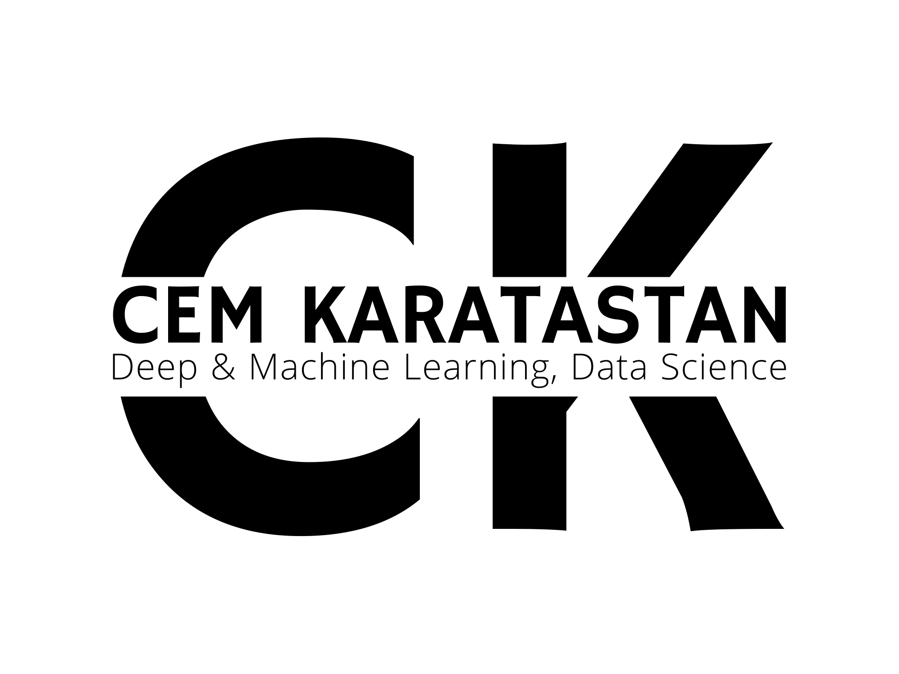

</img>  

<h2 align="center">A Passionate Future Machine Learning Engineer from Germany</h2>

## I'm a Self-Taught, Contributor, Developer and Researcher!!

- 🔭 Master of Science right now. I'm documenting my #66DaysOfMLOps journey...
- 🧙‍♂️ I'm Machine Learning Engineer at Siemens Healthineers, Erlangen/ Germany. 
- 🎯 I’m currently learning Real-world Pattern Recognition and DL Operations
- 👯 Fun fact: I love to dance and meet new people
- 🥅 2022 Goals: Contribute more to Open Source and Communities;

&emsp;&emsp;&emsp;&ensp;
   

<!---*  -->
 <!---*  -->

 

 ## ⭐ My projects
 
<!---* [will be added soon here]📌 -->
<!---* [Many of my projects are private because of the data protection policies of companies I worked.]📌 -->
 

## 📬 Connect with me:

&nbsp;
 

  
  

